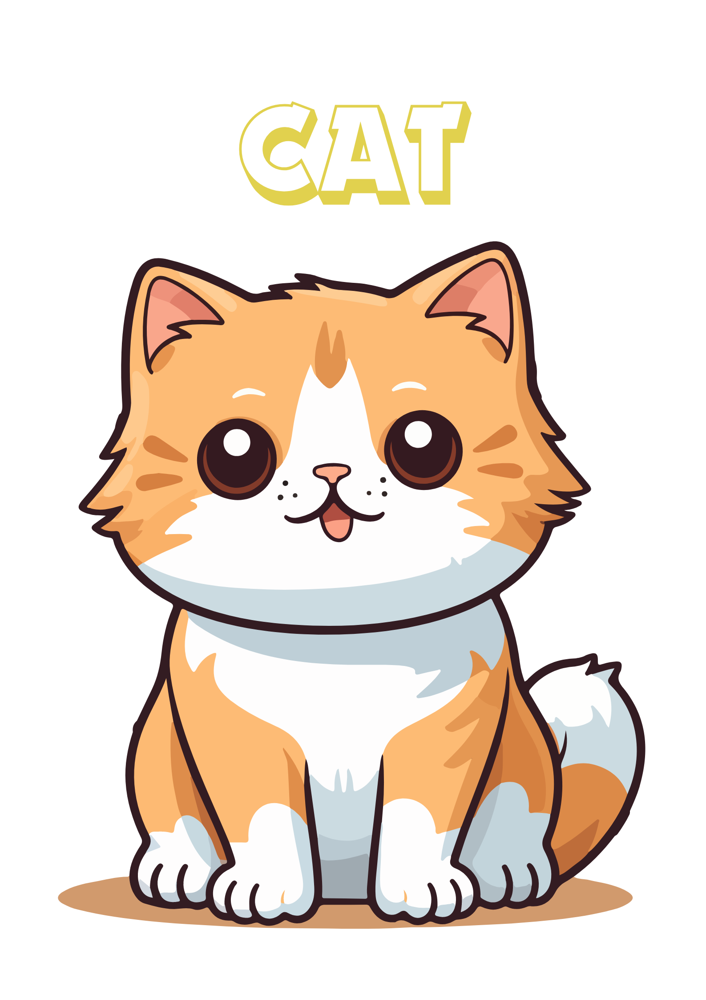
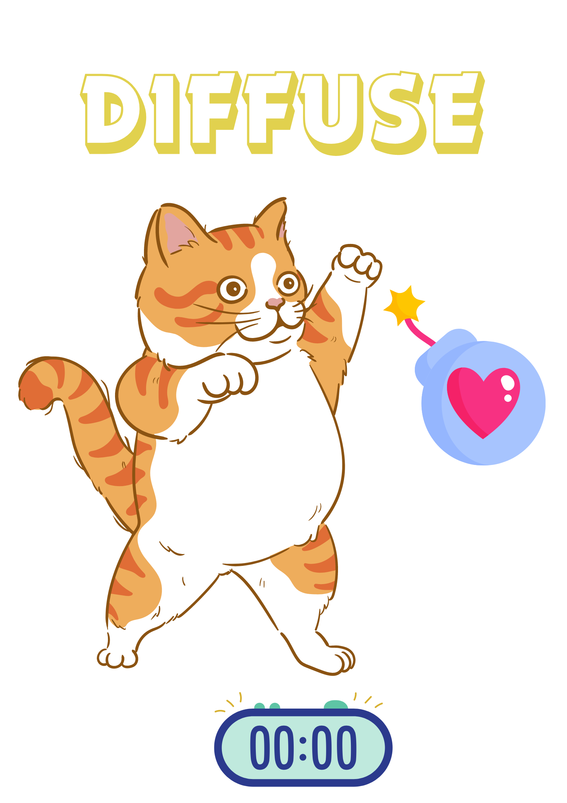
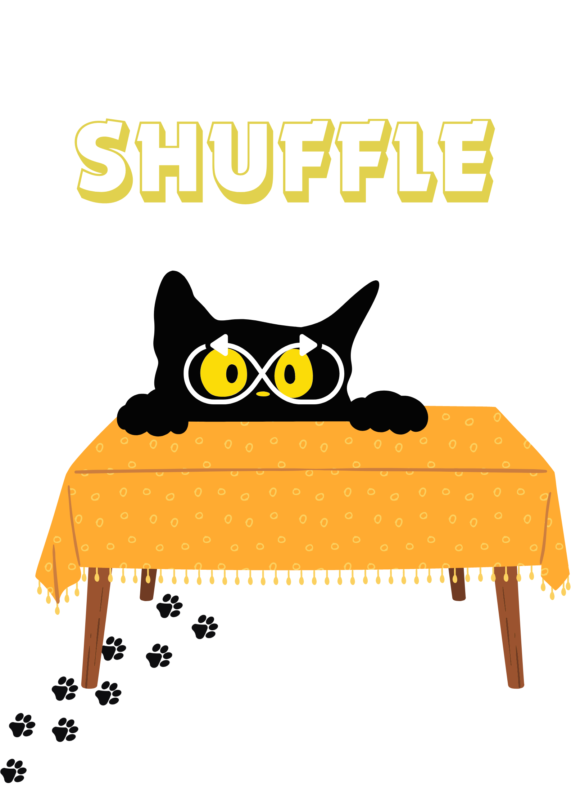
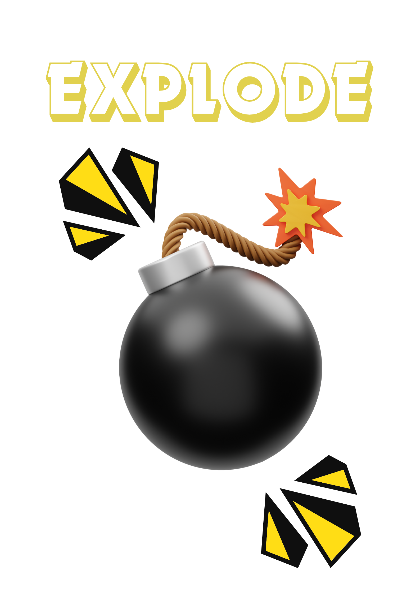

# Exploding Kittens Card Game 🃏


Welcome to the Exploding Kittens card game! This online, single-player game challenges you to draw cards from a deck while avoiding the exploding kittens that could make you lose. Let’s take a look at how the game functions and how you can play it on your local setup.

## Working

  <video controls height="130">
  <source src="Screenshots/gameFilm.mp4" type="video/quicktime">
    Sorry! Your browser does not support the video tag.
  </video>


## Working of the game:

### Rules:
- **Types of Cards in the game:**
  - 😺 **Cat Card**: Harmless card, just a cute cat.
  - 🙅‍♂️ **Defuse Card**: Used to defuse an exploding kitten.
  - 🔀 **Shuffle Card**: Shuffles the deck and resets the game.
  - 💣 **Exploding Kitten Card**: Instant game over if drawn.


    
    
    
    


- **Gameplay:**
  - Clicking on the deck will reveal a card.
  - If the card is a cat card, it is taken out of the deck.
  - If you draw an exploding kitten and don’t have a defuse card, you lose the game.
  - If you draw a defuse card, it’s removed from the deck and can be used later to neutralize an exploding kitten.
  - If you draw a shuffle card, the deck is reshuffled, and the game restarts.
  - To win, you need to draw all the non-exploding kitten cards.

### File Directory of the Game

```
   |-- exploding-kitten-game
|   |-- exploding-kittens-backend/
|   |   |-- go.env
|   |   |-- go.mod
|   |   |-- go.sum
|   |   |-- main.go
|-- exploding-kittens-frontend/
|   |-- node_modules/
|   |-- public/
|   |   |-- index.html
|   |   |-- favicon.ico
|   |   |-- manifest.json
|   |-- src/
|   |   |-- components/
|   |   |   |-- CardBlock.js
|   |   |   |-- LeaderBoard.js
|   |   |   |-- NameForm.js
|   |   |   |-- Navbar.js
|   |   |   |-- Toast.js
|   |   |-- assets/
|   |   |   |-- cat1.png
|   |   |   |-- cat2.png
|   |   |   |-- cat3.png
|   |   |   |-- cat4.png
|   |   |-- App.js
|   |   |-- App.css
|   |   |-- App.test.js
|   |   |-- index.js
|   |   |-- index.css
|   |   |-- logo.svg
|   |   |-- reportWebVitals.js
|   |   |-- setupTests.js
|   |-- package.json
|   |-- package-lock.json
|   |-- .gitignore
|   |-- README.md
```

### For Node.js (React Frontend):
1. Install dependencies: `npm install`
2. Start the frontend server: `npm start`
3. Access the game at: `http://localhost:8000`

### For Go Lang (Backend):
1. Install dependencies: `go mod tidy`
2. Build the Go server: `go build -o main`
3. Start the server: `./main.`

Sure, here are the steps to set up Redis for your project along with some example code snippets:

### For Redis DB(Backend):

#### Step 1: Install Redis

First, you need to install Redis on your system. You can download and install Redis from the official website or use package managers like `apt` or `brew` depending on your operating system.

#### Step 2: Start Redis Server

Start the Redis server on your local machine. You can do this by running the following command in your terminal:

```bash
redis-server
redis-server-start
```

This command will start the Redis server with default configurations.


#### Step 3: Close Redis Connection

Don't forget to close the Redis connection when you're done:

```bash
redis-server-stop
```
That's it! You've successfully set up Redis for your project and connected to it using Go Lang. Now you can use Redis to store and retrieve data as needed.


## Tech Stack Used
- ReactJs
- Redux
- GoLang
- Redis

## ScreenShots:


## Contributions and License
This project is open for contributions. Feel free to fork the repository, make changes, and submit a pull request. There is no license specified for this project. Enjoy playing and happy coding!
